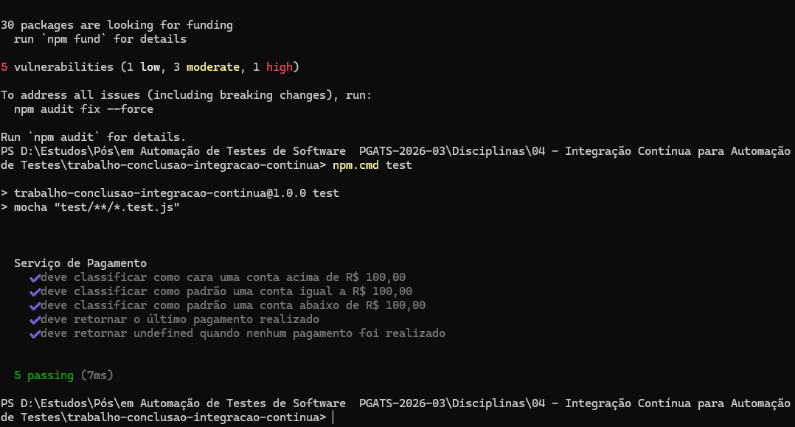
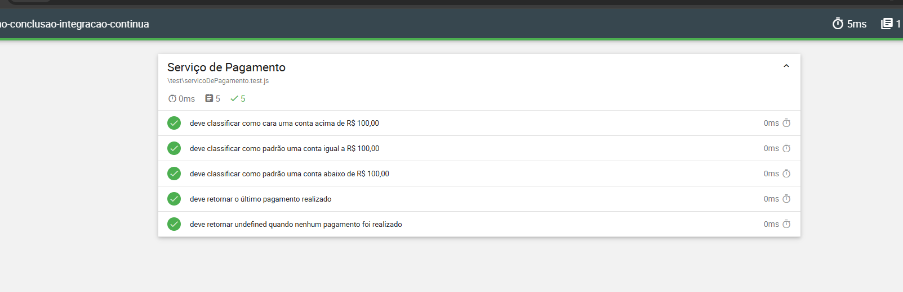
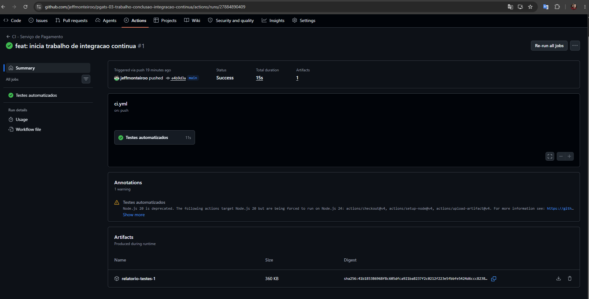
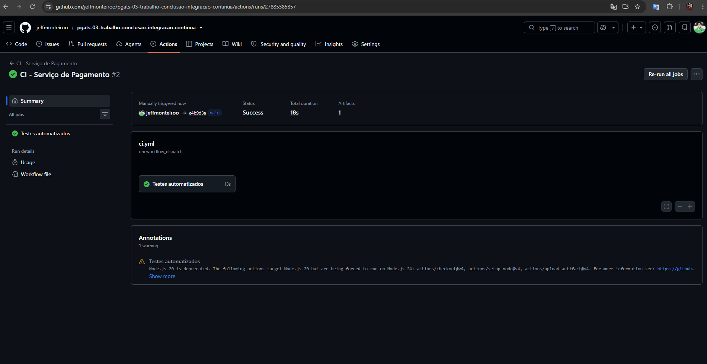
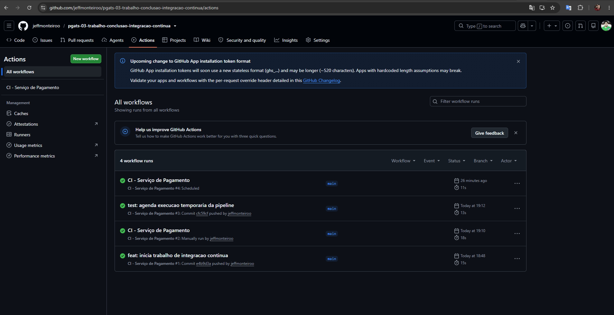

# Trabalho de Conclusão — Integração Contínua

Projeto desenvolvido para o trabalho de conclusão da disciplina **Integração
Contínua para Automação de Testes**, da pós-graduação em Automação de Testes
de Software.

## Sobre o projeto

A aplicação simula um serviço de pagamento de contas. Cada pagamento registra
o código de barras, a empresa, o valor e uma categoria:

- Valor acima de R$ 100,00: categoria `cara`;
- Valor igual ou abaixo de R$ 100,00: categoria `padrão`.

O projeto utiliza testes automatizados e uma pipeline de integração contínua
no GitHub Actions.

## Tecnologias

- JavaScript;
- Node.js 22;
- Mocha;
- Mochawesome;
- GitHub Actions.

## Execução local

```bash
npm install
npm test
```

Para executar os testes e gerar o relatório HTML e JSON:

```bash
npm run test:report
```

## Pipeline

O workflow inicial está em `.github/workflows/ci.yml` e contempla:

- Execução automática por push na branch `main`;
- Execução manual com `workflow_dispatch`;
- Execução agendada diariamente às 21:00, no horário de Brasília;
- Execução dos testes automatizados;
- Geração de relatório com Mochawesome;
- Armazenamento do relatório como artefato.

## Evidências

### Testes executados localmente



### Relatório Mochawesome



### Execução automática por push e publicação do artefato



### Execução manual



### Execução agendada


